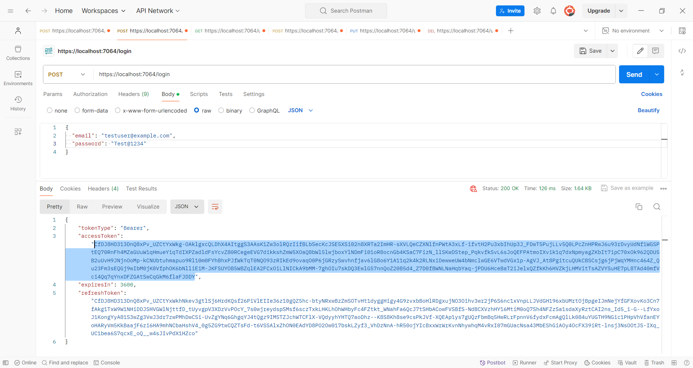
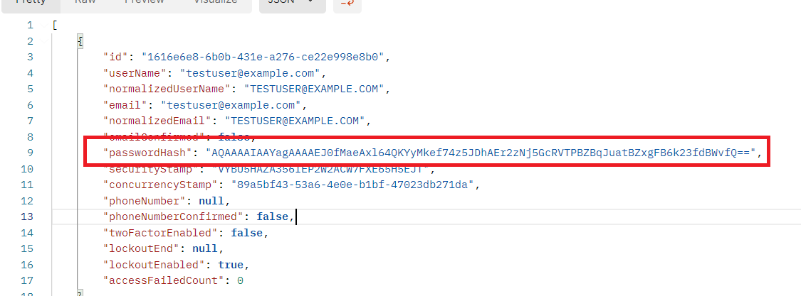

# UserManagementAPI

Đây là một ứng dụng ASP.NET Core đơn giản sử dụng hệ thống Identity để quản lý người dùng. Ứng dụng này hỗ trợ các thao tác cơ bản như đăng ký, đăng nhập, thay đổi mật khẩu và quản lý người dùng.


## Gói NuGet sử dụng


### Microsoft.AspNetCore.Identity.EntityFrameworkCore
Sử dụng Identity Entity Framework Core để quản lý dữ liệu người dùng, bao gồm các tác vụ như đăng ký, đăng nhập, xác thực, quản lý roles.

### Microsoft.EntityFrameworkCore.InMemory
Đây là provider cơ sở dữ liệu InMemory, nó cho phép lưu trữ dữ liệu trong bộ nhớ mà không cần phải connect với một database.


## API Endpoints

Dưới đây là danh sách các endpoint:


Tuy nhiên trong phần này sẽ tập trung vào các endpoint 
- User Registration
- Login
- Change Password
- User Management:
+ List User
+ Edit User
+ Delete User


### POST /register
- **Mô tả**: Endpoint này được sử dụng để đăng ký một người dùng mới trong hệ thống.
- **Request Body**: Dữ liệu đăng ký bao gồm username, password, email, v.v.


Tiến hành register 3 tài khoản bao gồm testuser, testuser1 và testuser2

### POST /login
- **Mô tả**: Endpoint này được sử dụng để đăng nhập người dùng.
- **Request Body**: email và password.
  


Sau khi Login thì sẽ có Bearer Token dùng để authenticate cho các endpoint tiếp theo


### POST /users/change-password/{id}
- **Mô tả**: Endpoint này được sử dụng để thay đổi mật khẩu của một người dùng.
- **Request Body**: Mật khẩu hiện tại và mật khẩu mới.
- **Authorization**: Yêu cầu token Bearer hợp lệ.
- **Parameters**: `{id}` là ID của người dùng cần thay đổi mật khẩu.




Đã đổi password thành công!

### GET /users
- **Mô tả**: Endpoint này trả về list user trong hệ thống.
- **Authorization**: Yêu cầu token Bearer hợp lệ.

  

### PUT /users/{id}
- **Mô tả**: Endpoint này được sử dụng để cập nhật thông tin của một người dùng.
- **Request Body**: Thông tin người dùng cần cập nhật.
- **Authorization**: Yêu cầu token Bearer hợp lệ.
- **Parameters**: `{id}` là ID của người dùng cần cập nhật.

  

Đổi userName thành DangTuanKiet2011068856 thành công

### DELETE /users/{id}
- **Mô tả**: Endpoint này xóa một người dùng dựa trên ID.
- **Authorization**: Yêu cầu token Bearer hợp lệ.
- **Parameters**: `{id}` là ID của người dùng cần xóa.

  

Sau khi Delete User thành công thì chỉ còn testuser1 và testuser2.


## Hướng dẫn cài đặt và chạy ứng dụng

1. **Clone repository**: ```git clone https://github.com/kietdang8856/UserManagementAPI```


2. **Cài đặt các gói NuGet cần thiết**:


3. **Chạy ứng dụng**: Run với Visual Studio.


4. **Truy cập API**: Sử dụng Postman để gửi yêu cầu tới các endpoint.
